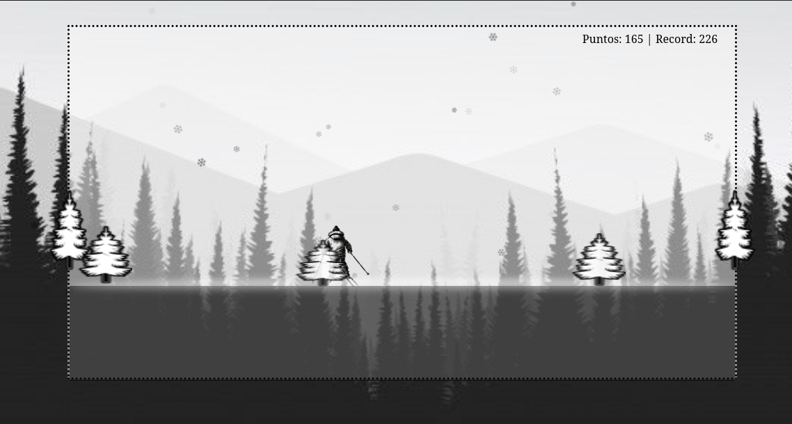

## 🎮 Mini Juego de Esquí - Portafolio Web - Snow-tree

##  Descripción

Este es un mini juego desarrollado con **JavaScript**. El jugador controla a un **esquiador** que baja por una montaña nevada evitando **chocar con los árboles**. Si colisionas... ¡pierdes! 🎄💥

## Características

- Personaje animado (esquiador) descendiendo automáticamente.
- Árboles como obstáculos que aparecen de forma aleatoria.
- Contador de puntuación basado en tiempo o distancia recorrida.
- Detección de colisiones.
- Estilo gráfico simple con imágenes en **2D**.
- Completamente hecho en **HTML, CSS y JavaScript**.

## 🖼️ Captura de pantalla

